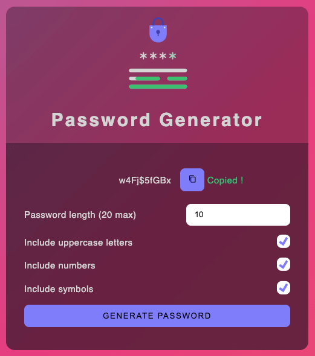

<a name="readme-top"></a>

[![Contributors][contributors-shield]][contributors-url]
[![Forks][forks-shield]][forks-url]
[![Stargazers][stars-shield]][stars-url]
[![Issues][issues-shield]][issues-url]
[![MIT License][license-shield]][license-url]
[![LinkedIn][linkedin-shield]][linkedin-url]

<!-- PROJECT LOGO -->
<br />
<div align="center">
  <a href="https://github.com/fernan-x/password-generator">
    
  </a>

<h3 align="center">Password Generator</h3>

  <p align="center">
    This application is a simple password generator application
    <br />
    <a href="https://github.com/fernan-x/password-generator"><strong>Explore the docs »</strong></a>
    <br />
    <br />
    <a href="https://fernan-x.github.io/password-generator/">View Demo</a>
    ·
    <a href="https://github.com/fernan-x/password-generator/issues">Report Bug</a>
    ·
    <a href="https://github.com/fernan-x/password-generator/issues">Request Feature</a>
  </p>
</div>

<!-- TABLE OF CONTENTS -->
<details>
  <summary>Table of Contents</summary>
  <ol>
    <li>
      <a href="#about-the-project">About The Project</a>
      <ul>
        <li><a href="#built-with">Built With</a></li>
      </ul>
    </li>
    <li>
      <a href="#getting-started">Getting Started</a>
      <ul>
        <li><a href="#prerequisites">Prerequisites</a></li>
        <li><a href="#installation">Installation</a></li>
      </ul>
    </li>
    <li><a href="#usage">Usage</a></li>
    <li><a href="#roadmap">Roadmap</a></li>
    <li><a href="#contributing">Contributing</a></li>
    <li><a href="#license">License</a></li>
    <li><a href="#contact">Contact</a></li>
  </ol>
</details>

<!-- ABOUT THE PROJECT -->

## About The Project

[![Product Name Screen Shot][product-screenshot]](https://github.com/fernan-x/password-generator)

<p align="right">(<a href="#readme-top">back to top</a>)</p>

### Built With

[![React][react.js]][react-url]
[![Typescript][typescript]][typescript-url]
[![Vite][vite]][vite-url]
[![Sass][sass]][sass-url]

<p align="right">(<a href="#readme-top">back to top</a>)</p>

<!-- GETTING STARTED -->

## Getting Started

To get started with this project, you can use `yarn`.

```sh
npm install --global yarn
```

### Installation

To run the application in local, you can follow this steps.

1. Clone the repo

   ```sh
   git clone https://github.com/fernan-x/password-generator.git
   ```

2. Install NPM packages

   ```sh
   yarn
   ```

3. Run the application in development mode

   ```sh
   yarn dev
   ```

To launch unit tests, you can run the `test` command.

```sh
yarn test
```

To build the application, you can run the `build` command.

```sh
yarn build
```

<p align="right">(<a href="#readme-top">back to top</a>)</p>

<!-- USAGE EXAMPLES -->

## Usage

This interface aims to help you generating strong password. Choose your password length (20 characters max), select if you want to include uppercase, numbers or symbols on your password and generate it.

After generation, you will see your generated password which can be copied with `Copy Button`.



<p align="right">(<a href="#readme-top">back to top</a>)</p>

<!-- ROADMAP -->

## Roadmap

> There are no functionnalities on the roadmap for now. Do not hesitate to propose any features you want to see on the application.

See the [open issues](https://github.com/fernan-x/password-generator/issues) for a full list of proposed features (and known issues).

<p align="right">(<a href="#readme-top">back to top</a>)</p>

<!-- CONTRIBUTING -->

## Contributing

Contributions are what make the open source community such an amazing place to learn, inspire, and create. Any contributions you make are **greatly appreciated**.

If you have a suggestion that would make this better, please fork the repo and create a pull request. You can also simply open an issue with the tag "enhancement".
Don't forget to give the project a star! Thanks again!

1. Fork the Project
2. Create your Feature Branch (`git checkout -b feature/AmazingFeature`)
3. Commit your Changes (`git commit -m 'Add some AmazingFeature'`)
4. Push to the Branch (`git push origin feature/AmazingFeature`)
5. Open a Pull Request

<p align="right">(<a href="#readme-top">back to top</a>)</p>

<!-- LICENSE -->

## License

Distributed under the MIT License. See `LICENSE.txt` for more information.

<p align="right">(<a href="#readme-top">back to top</a>)</p>

<!-- CONTACT -->

## Contact

Fabien FERNANDES ALVES - fernandesalvesfabien@gmail.com

Project Link: [https://github.com/fernan-x/password-generator](https://github.com/fernan-x/password-generator)

<p align="right">(<a href="#readme-top">back to top</a>)</p>

<!-- MARKDOWN LINKS & IMAGES -->
<!-- https://www.markdownguide.org/basic-syntax/#reference-style-links -->

[contributors-shield]: https://img.shields.io/github/contributors/fernan-x/password-generator.svg?style=for-the-badge
[contributors-url]: https://github.com/fernan-x/password-generator/graphs/contributors
[forks-shield]: https://img.shields.io/github/forks/fernan-x/password-generator.svg?style=for-the-badge
[forks-url]: https://github.com/fernan-x/password-generator/network/members
[stars-shield]: https://img.shields.io/github/stars/fernan-x/password-generator.svg?style=for-the-badge
[stars-url]: https://github.com/fernan-x/password-generator/stargazers
[issues-shield]: https://img.shields.io/github/issues/fernan-x/password-generator.svg?style=for-the-badge
[issues-url]: https://github.com/fernan-x/password-generator/issues
[license-shield]: https://img.shields.io/github/license/fernan-x/password-generator.svg?style=for-the-badge
[license-url]: https://github.com/fernan-x/password-generator/blob/master/LICENSE.txt
[linkedin-shield]: https://img.shields.io/badge/-LinkedIn-black.svg?style=for-the-badge&logo=linkedin&colorB=555
[linkedin-url]: https://linkedin.com/in/fabien-fernandes-alves
[product-screenshot]: images/main-image.png
[react.js]: https://img.shields.io/badge/React-20232A?style=for-the-badge&logo=react&logoColor=61DAFB
[react-url]: https://reactjs.org/
[typescript]: https://img.shields.io/badge/Typescript-20232A?style=for-the-badge&logo=typescript
[typescript-url]: https://www.typescriptlang.org/
[vite]: https://img.shields.io/badge/Vite-20232A?style=for-the-badge&logo=vite
[vite-url]: https://vitejs.dev/
[sass]: https://img.shields.io/badge/Sass-20232A?style=for-the-badge&logo=sass
[sass-url]: https://sass-lang.com/
